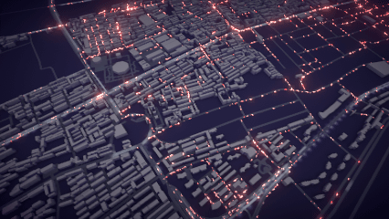
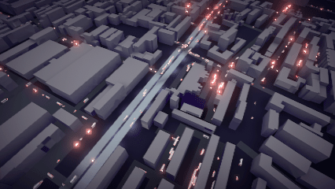
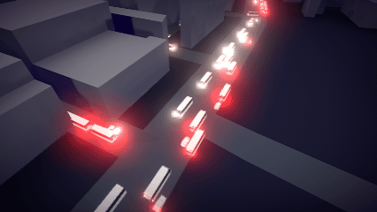
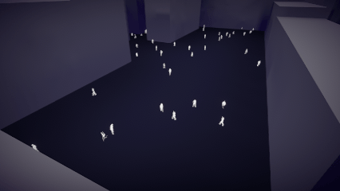
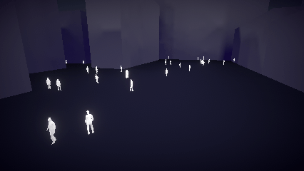
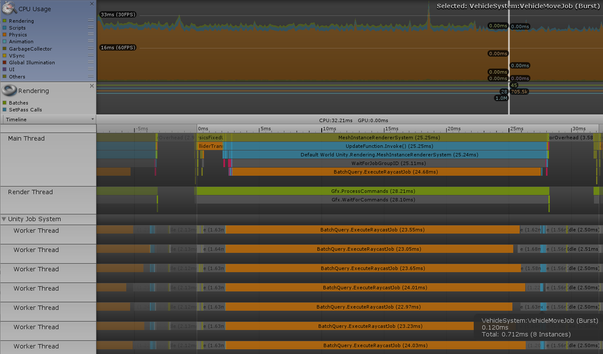

OSMTrafficSim
========

**OSMTrafficSim** is project to simulate city traffic. 

Taking advantage of Unity's recent [Entity-Componet-System](https://github.com/Unity-Technologies/EntityComponentSystemSamples) technology, this project exploits the protential of multi-core processors, simulating 25k cars, 10k pedestrian at 30fps on my laptop.

A BVH is constructed for vehicle's communication. Implementing the method described in [Thinking Parallel, Part III: Tree Construction on the GPU](https://devblogs.nvidia.com/thinking-parallel-part-iii-tree-construction-gpu/)

The animation of pedestrian use vertex animation texture tool form Houdini's [GameDevelopmentTool](https://github.com/sideeffects/GameDevelopmentToolset). Animation state transition use Markov Chain methods.

The city's model is generated using OSM OpenStreetMap. I takes some tools also form Houdini's [GameDevelopmentTool](https://github.com/sideeffects/GameDevelopmentToolset) to generate the city's static model.     
Road's abstract graph is also generated using OpenStreetMap data, an example data is places in Assets\OSM folder. You can right click on it in Unity's Project window and select **ParseToRoadGraph** to convert it to data in Unity.

See My Blog [Unity ECS and Traffic Simulation | UnityECS架构与交通模拟](http://ma-yidong.com/2018/11/04/unity-ecs-and-traffic-simulation/) and [Unity ECS, Swarm Animation And Markov Chain| ECS集群动画与马尔可夫链](http://ma-yidong.com/2018/11/24/unity-ecs-swarm-animation-and-markov-chain/)for more detail

System requirements
-------------------

- Unity 2018.3 or later
